# Microsoft Sentinel SIEM Deployment and Configuration

## 📚 Table of Contents

- [Project Overview](#project-overview)
- [Prerequisites](#prerequisites)
- [Deployment of Microsoft Sentinel](#️-deployment-of-microsoft-sentinel)
- [Configure Diagnostic Settings](#configure-diagnostic-settings)
- [Explore Microsoft Sentinel](#explore-microsoft-sentinel)
- [Enable User Entity Behavior Analytics (UEBA)](#enable-user-entity-behavior-analytics-ueba)
- [Create a Watchlist](#create-a-watchlist)
- [Create a Detection Rule](#create-a-detection-rule)
- [Create and Test New User](#create-and-test-new-user)
- [Monitor Alerts in Sentinel](#monitor-alerts-in-sentinel)
- [Investigate User Behavior](#️-investigate-user-behavior)
- [Secure the Azure Environment](#secure-the-azure-environment)
- [Conclusion](#conclusion)

## Project Overview

This project documents the deployment and configuration of **Microsoft Sentinel** on Azure, including creating detection rules, watchlists, and user testing. It provides hands-on experience with SIEM tools for monitoring, detection, and incident response.

---

## Prerequisites

- [Azure Portal Account](https://portal.azure.com/)  
- [Microsoft Sentinel GitHub Repository](https://github.com/Azure/Azure-Sentinel/tree/master/Tools/Sentinel-All-In-One)  
- [Brave Browser](https://brave.com/)

---

## Deployment of Microsoft Sentinel

1. Open the GitHub repository → Click **Deploy to Azure** → Opens Azure Portal.

2. In **Settings**, enable **Sentinel Health Diagnostics**.

3. Select default options for:
   - Connect hub solution
   - Data connectors
   - Analytics rules

4. Click **Review and Create**.

> **Note:** You may encounter license errors in some connectors; this is expected.

**Screenshot Placeholder:**  
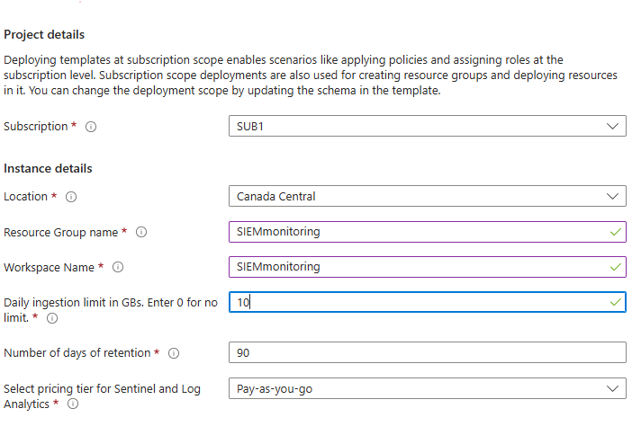
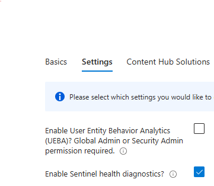

---

## Configure Diagnostic Settings

- Go to **Resource Group → Diagnostic Setting → Add New Diagnostic Setting → Save**

**Screenshot Placeholder:**  
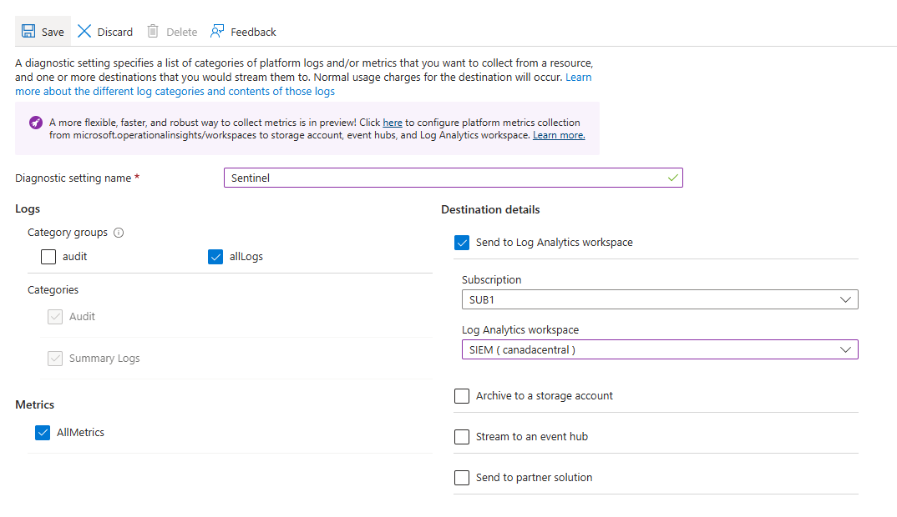

---

## Explore Microsoft Sentinel

- Navigate to **Microsoft Sentinel → [Your Workspace] → Overview**
- Review the **Analytics** tab for detection rules.

**Screenshot Placeholder:**  
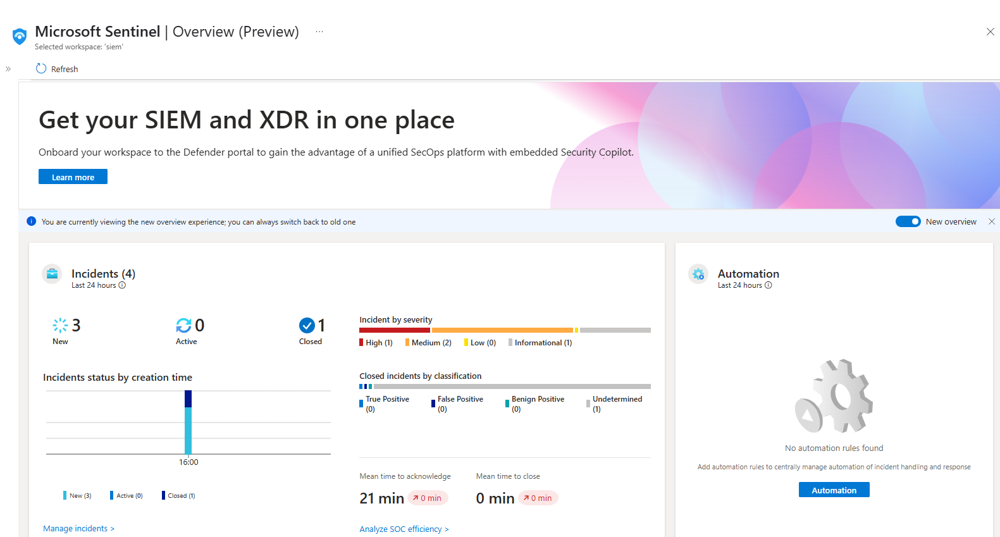  
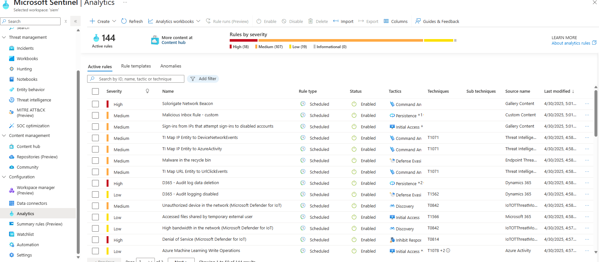
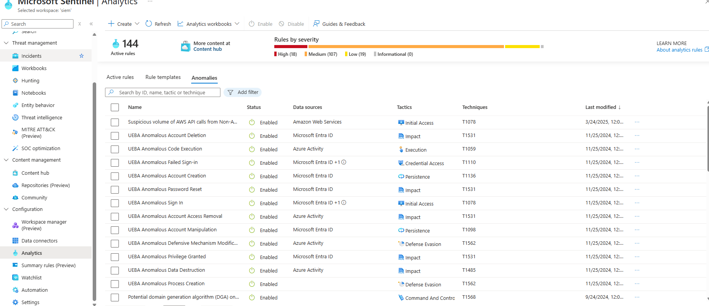

---

## Enable User Entity Behavior Analytics (UEBA)

1. Go to **Settings → UEBA → Set Azure Directory or Entra ID → Apply**.
2. Configure **Playbook Permissions**:
   - Select the resource group.
   - Apply changes.

---

## Create a Watchlist

1. Go to **Configuration → Watchlist → Create New**.
2. Name the watchlist, upload `Tor-Exit-Node.csv`.
3. Click **View in Logs**.

**Screenshot Placeholder:**  
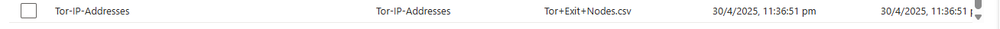

---

## Create a Detection Rule

1. Go to **Configuration → Analytics → Create New Scheduled Query Rule**.
2. Configure rule logic, entity mapping, alert details.
3. Set schedule to **5 min**, enable **Alert Grouping**.
4. Click **Review and Create**.

**Screenshot Placeholder:**  
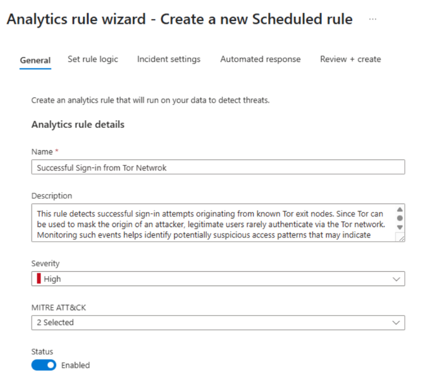

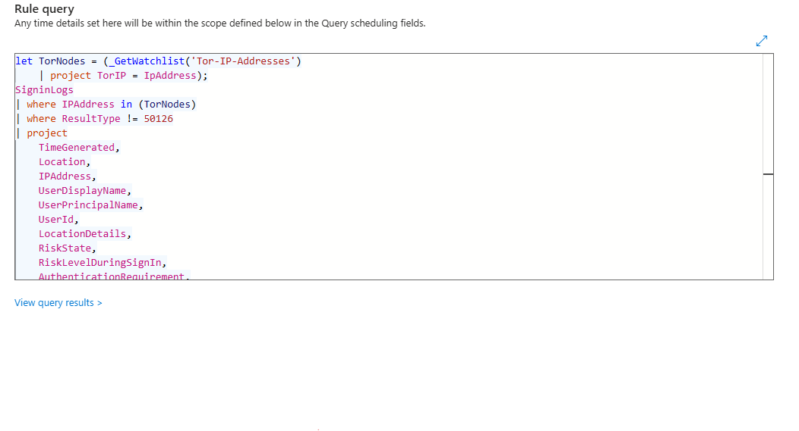

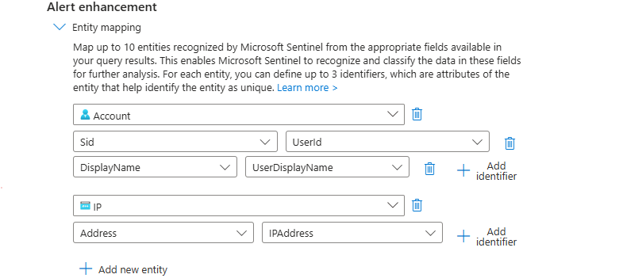

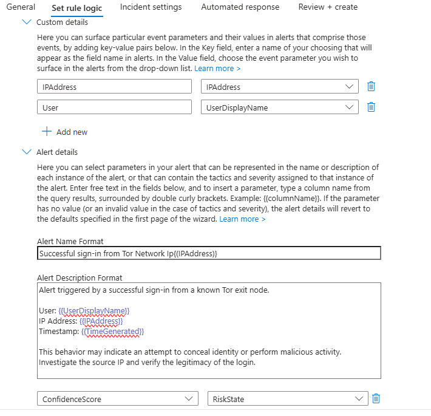

---

## Create and Test New User

1. Disable **Security Defaults** in Azure Active Directory.
2. Create user `malice`, assign:
   - **Security Reader** role.
   - **Contributor** role via IAM.
3. Log in via Brave private window.
4. Test by modifying or deleting the diagnostic rule.

---

## Monitor Alerts in Sentinel

1. Check dashboard for **Tor sign-in alerts**.
2. Assign incident owner, set status.
3. View incident details.

**Screenshot Placeholder:**  
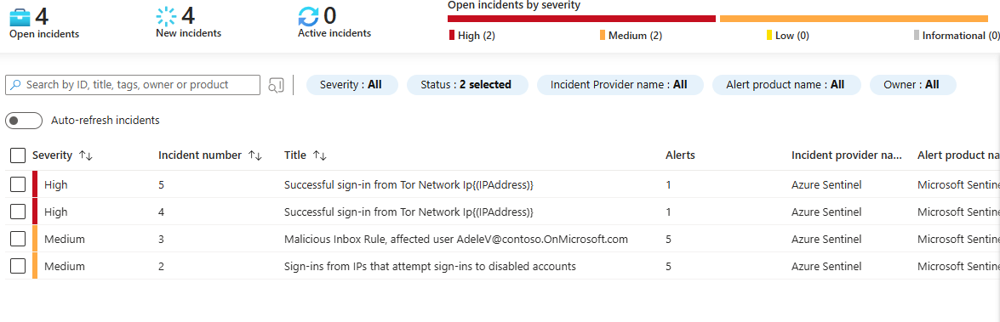`  
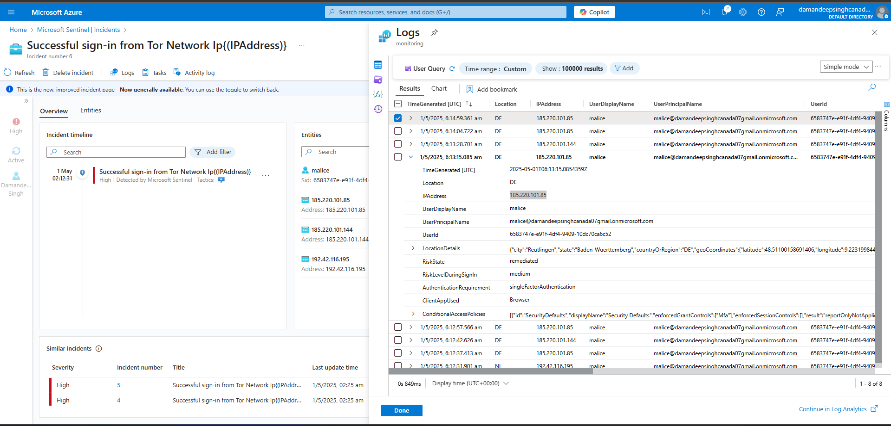

---

## Investigate User Behavior

- Go to **Entity Behavior → Select User → View Alerts**

**Screenshot Placeholder:**  
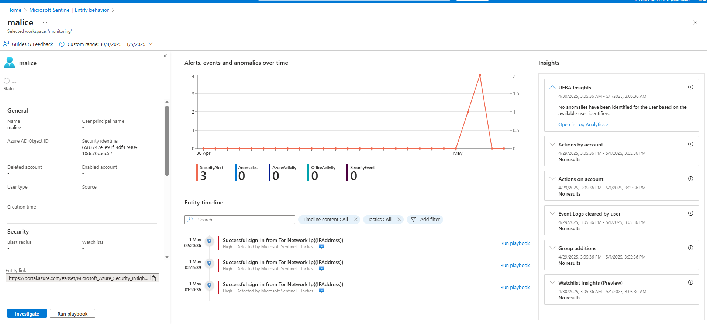

---

## Secure the Azure Environment

- Disable compromised accounts.
- Enable diagnostic settings.
- Close incidents with notes.

**Screenshot Placeholder:**  
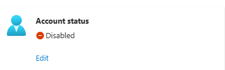

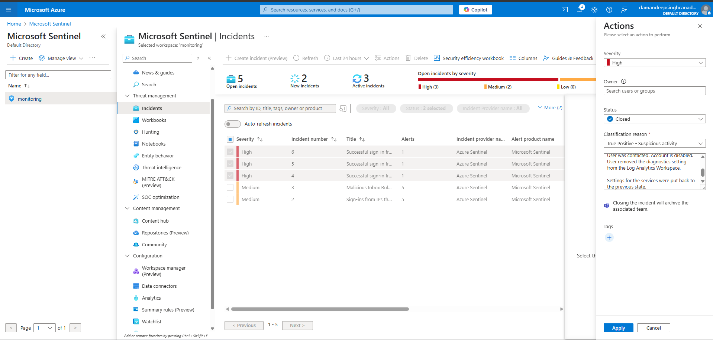

---

## Conclusion

This project demonstrates the end-to-end deployment and configuration of Microsoft Sentinel SIEM on Azure, covering everything from setting up data connectors and watchlists to creating custom detection rules and conducting incident investigations. By completing this project, I strengthened my hands-on experience in cloud security, incident response, and threat monitoring.

The project highlights the importance of proactive security measures, continuous monitoring, and detailed incident documentation to improve an organization’s security posture.

Feel free to explore the code, configuration steps, and documentation, and reach out if you have any questions or suggestions!

---

